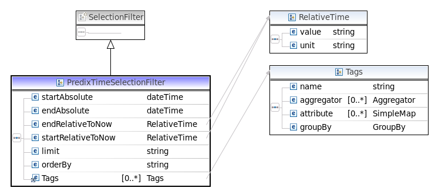
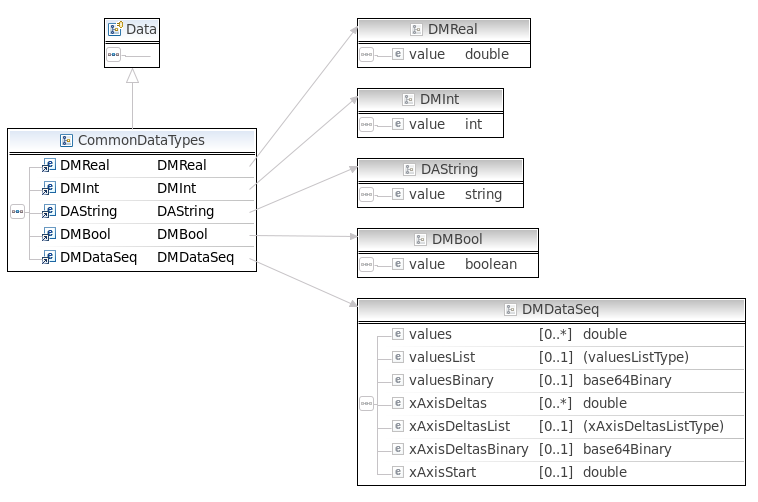

fdh-router-service
==================

FDH is a Federated Data Handler that routes Get/Put requests to a DataHandler.  PredixAssetHandler and PredixTimeseriesHandler are currently supported.  You can add Handlers to other datasources as needed.  The intent here is to create consistency across your apis in the cloud and on the edge allowing for data and algorithm portability 


Any service, such as [rmd-analytics](https://github.com/predixdev/rmd-analytics) or [Ingestion](https://github.com/predixdev/dataingestion-service) can leverage the FDH to pass runtime requests to get or put data.  The api, architecture and implementation are portable beyond cloud microservices.  The api provides data resolution for any field from any datasource (customer specific datasources, files, hadoop, rdbms, cache, Asset, Timeseries, etc)

##Traversing the Model

The 'field' is nothing more than a URI representing attributes or entities in a source system.  E.g. the field /asset/assetId represents the assetId attribute on the Asset entity.  Or /address/addressLine1 represents the addressLine1 field on the Address entity.  

It turns out that all json structures are primitives, objects, maps or lists.  In this example, we search for an Asset trying to retrieve the OutputMaximum attribute.  The items in-between are a traversal of the Asset object-graph json.  Predix Asset supports any 'model' json structure.  In this case the model is an Asset.  But it could be /plan/wingspan or /address/city.  


Our implementation uses standard json libraries to find the attribute within the model.  We use Jackson since it handles polymorphic objects better than Gson.  We also do not have to register mappers for each object type we create.  This should increase productivity since you can concentrate on Modeling and not the plumbing of marshaling/unmarshaling Json.

##GetFieldData

(future)The current GetData api uses a POST body.  Using Rest semantics it should be quite easy to create a Rest GET api accessing any field in any datasource.

(future)Seemlessly mapping these Rest semantics to SQL semantics has been done in the past but is not ported to the cloud.  This allows the traversal of any Object/Relational Graph relative to an 'id', such as an assetId.  

The GetFieldData api has a simple List of Criteria, shown below.  Each criteria has a FieldIdentifier and a SelectionFilter.  In this example we are retreiving the outputMaximum attribute on an Asset.AssetMeter("crank-frame-dischargepressure") where /asset/assetId = "/asset/compressor-2015".  AssetMeter is a map.  

Notice the use of the FieldIdentifier object, you'll see this alot and the id and source is how the api handles Federated datasources.  Also note the FieldIdentifier is typed.  Identifier has polymorphic semantics so you can have a list of varying ids, very helpful in a SOA.

```json
{
			"fieldSelection": 
			[
				{
					"fieldIdentifier": 
					{
						"@type": "FieldIdentifier",
						"id": "/asset/assetMeter/crank-frame-dischargepressure/outputMaximum",
						"source": "PREDIX_ASSET"
					},
					"expectedDataType": "DMReal",
					"resultId": "ALARM_HI"
				}
			],
			"selectionFilter": 
			{
				"@type": "FieldSelectionFilter",
				"fieldIdentifierValue": 
				[
					{
						"fieldIdentifier": 
						{
							"@type": "FieldIdentifier",
							"id": "/asset/assetId",
							"source": "PREDIX_ASSET"
						},
						"value": "/asset/compressor-2015"
					}
				]
			},
			"resultId": "ALARM_HI"
		}
```

Here is the same structure in a picture.  Defined in an xsd.


The FieldIdentifer has an id, name, and source.  The id is a Rest principle based string indicating where to find the Real, Int, String, Bool, Timeseries or other attribute.  The "source" drives Routing decisions to Handlers.  More rules based routing can be employed yourself as a custom situation.


The Selection Filter is a where clause which has Animal, Cat, Dog polymorphic semantics.  We can define any Selection Filter we want.  We have defined 2 SelectionFilters which will take you a long way in Predix.  A TimeSelectionFilter which mirrors the Predix Timeseries API and simply 'extends' SelectionFilter.  And a FieldSelectionFilter which allows for basic AND/OR semantics similar to a where clause.    SelectionFilters can return multiple Models (like rows in a database) and thus actions can be performed on the set of data returned.




##PutFieldData

This is a PutFieldDataCriteria setting the alertStatus attribute to false.  The object traversal is a little long due to historic factors.  This is from a working anlaytics example where we can jump to another Model in Predix Asset, in this case the MeterExtensions model.  In other words, we searched for an Asset but the alertStatus.value is from a second query for MeterExtensions following the MeterExtensions.uri much like a foreign key.  The PredixAssetHandler does all this traversal seemlessly, you can define Fields without having to code the object graph traversal each time.  This allows you to solve the problem at hand and not worry about the Json Objects.

```json
"putFieldDataCriteria": 
	[
		{
			"fieldData": 
			{
				"field": 
				{
					"fieldIdentifier": 
					{
						"@type": "FieldIdentifier",
						"id": "/asset/assetMeter/crank-frame-dischargepressure/meterDatasource/meterExtensions/attributes/alertStatus/value",
						"source": "PREDIX_ASSET"
					},
				},
				"data": 
				{
					"@type": "OsaData",
					"dataEvent": 
					{
						"@type": "DMBool",
						"value": false
					}
				}
			},
			"selectionFilter": 
			{
				"@type": "FieldSelectionFilter",
				"fieldIdentifierValue": 
				[
					{
						"fieldIdentifier": 
						{
							"@type": "FieldIdentifier",
							"id": "/asset/assetId",
							"source": "PREDIX_ASSET"
						},
						"value": "/asset/compressor-2015"
					}
				]
			}
		}
	]
```

##GetFieldDataResult

The GetFieldDataResult and PutFieldDataRequest use a FieldData structure.  The Field represents the attribute for which the Data is for.  The Data also has Animal, Cat, Dog polymorphic semantics and can be any Data structure that you define.  Since this is the Industrial Internet, engineering units are also defined.

(future) Solution Services will provide an Engineering Unit converter service tile in the cloud.


##Data

The most common data structures are Real, Int, Boolean, String, Timeseries, but any Data Type can be defined.  We recommend updating only single attributes within a larger structure.  This allows long-running algorithms to not update stale data.  (future) We recommend an optimistic locking technique be employed as a best-practice.

This is a notional image just to give a quick overview of the common types of data.  The actual structure varies.

##Tech Stack
- Spring
- SpringBoot
- SpringTest
- Maven

##Microcomponents
- [AssetBootstrap](https://github.com/predixdev/asset-bootstrap)
- [TimeseriesBootstrap](https://github.com/predixdev/timeseries-bootstrap)
- [PredixBoot](https://github.com/predixdev/predix-boot)
- [PredixRestClient](https://github.com/predixdev/predix-boot)

### More Details
* [More GE resources](http://github.com/predixdev/predix-rmd-ref-app/docs/resources.md)
* [RMD Reference App](http://github.com/predixdev/predix-rmd-ref-app)
