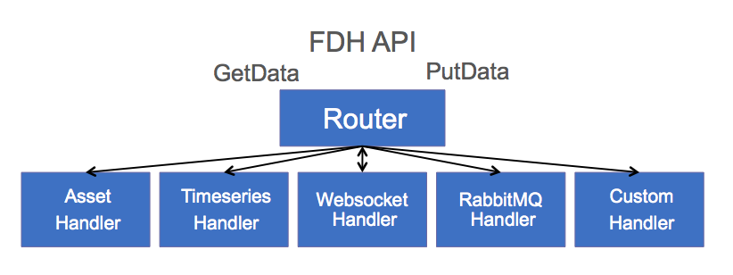

Data Exchange<br>
<a href="http://predixdev.github.io/fdh-router-service/javadocs/data-exchange/index.html" target="_blank" >
	</a>
<br>FDH Asset Handler<br>
<a href="http://predixdev.github.io/fdh-router-service/javadocs/fdh-asset-handler/index.html" target="_blank" >
	</a>
<br>FDH Bootstrap Client<br>
<a href="http://predixdev.github.io/fdh-router-service/javadocs/fdh-bootstrap-client/index.html" target="_blank" >
	</a>
<br>FDH Custom Handler<br>
<a href="http://predixdev.github.io/fdh-router-service/javadocs/fdh-custom-handler/index.html" target="_blank" >
	</a>
<br>FDH Time Series Handler<br>
<a href="http://predixdev.github.io/fdh-router-service/javadocs/fdh-timeseries-handler/index.html" target="_blank" >
	</a>
<br>
<a href="http://predixdev.github.io/fdh-router-service" target="_blank">
	
</a>
Data Exchange Federated Data Handler
==================

Data Exchange is a Federated Data Handler that routes Get/Put requests to a DataHandler. Data Exchange is used to retrieve or store any Data Field from any Datasource with any Filter where clause.  

PredixAssetHandler, PredixTimeseriesHandler, WebsocketHandler, and RabbitMqHandler are currently supported.  You can add Handlers to other datasources as needed.  The intent here is to create consistency across your apis in the cloud and on the edge allowing for data and algorithm portability.



Any service, such as [rmd-analytics](https://github.com/predixdev/rmd-analytics) or [Ingestion](https://github.com/predixdev/dataingestion-service) can leverage the Data Exchange to pass runtime requests to get or put data.  The api, architecture and implementation are portable beyond cloud microservices.  The api provides data resolution for any field from any datasource (customer specific datasources, files, hadoop, rdbms, cache, Asset, Timeseries, etc)

Runtime resolution of Fields allows for saved Queries applied to Event data.  Once a Handler is written, you won't have to return to it.  This frees up the team to build more value-add services and not worry about the Data Retrieval and Storage.  Also you can swap out Data Sources quite easily by adding a different Handler.

##When do I need Data Exchange?

- I need to get data from multiple data sources with a single call
- I need to put data results to multiple data sources with a single call
- I need to save requests for runtime data binding acting on different Asset Ids
- I need to request data in Units of Measure (celcius vs. fahrenheit e.g.) than the data is stored in
- I need to request data in different formats, specifically common formats, than the data is stored in
- I need to work with different transport layers or technologies (REST, WebSockets, Queues, Databases)
- I need to use Predix provided data sources and also my own data sources and do runtime data binding with unit of measure conversion and data transformation to leverage other processes, such as analytics, expecting data in a certain format and unit.


##Semantics

All data sources can store records and many have query languages to retrieve records.

Data Exchange has two semantics

- Get DATA from a SOURCE using a FILTER.  The FIELD indicates whether to return the entire record set or items from within.    
- Put DATA to a SOURCE using a FILTER.  The FIELD indicates whether to store the entire data or within a record.

In many cases Data Exchange is a pass through.  In others, the process needing data requires it in a different shape.  In Predix we favor the Predix data structures, but Data Exchange allows you to use your custom data shapes too.

##FIELDS help Traverse the Model

The 'field' is nothing more than a URI representing attributes or entities in a source system.  E.g. the field /asset/assetId represents the assetId attribute on the Asset entity.  Or /address/addressLine1 represents the addressLine1 field on the Address entity.  

Let's take the data source of Predix Asset as an example.  Predix Asset supports any JSON structure.  We used a FILTER to find the Predix Asset record.  But we also might need as specific attribute within that JSON record.  

In JSON, all structures are primitives, objects, maps or lists.  In this example, we search for an Asset trying to retrieve the OutputMaximum attribute.  The items in-between are a traversal of the Asset object-graph json.  In this case the model is a generic asset called "Asset".  But it could be /plane/wingspan or /address/city.  


>Our implementation uses standard json libraries to find the attribute within the model.  We use Jackson since it handles polymorphic objects better than Gson.  We also do not have to register mappers for each object type we create.  This should increase productivity since you can concentrate on Modeling and not the plumbing of marshaling/unmarshaling Json.

##DataSource

A Field uri represents a data attribute or entity, but where does that data come from?  You simply define the Source in the GET request and the router sends the GET or PUT request on to the right Handler.  In this example the data source for outputMaximum of crank-frame-discharge-pressure on an AssetTag on an Asset named Compressor-2015, is PREDIX_ASSET, so the GET request is simply forwarded on to the PredixAssetHandler.

```json

					"fieldIdentifier": 
					{
						"complexType": "FieldIdentifier",
						"id": "/asset/assetTag/crank-frame-dischargepressure/outputMaximum",
						"source": "PREDIX_ASSET"
					},
					"expectedDataType": "DMReal",
					"resultId": "ALARM_HI"
```

This nice thing to notice here is that Configuring this GET request ahead of time, allows for late data-binding at runtime from any Data Source.

##GetFieldData - GET
(future)The current GetData api uses a POST body.  Using Rest semantics it should be quite easy to create a Rest GET api accessing any field in any datasource.

##GetFieldData - RelationalDBHandler - POST
(future)Seemlessly mapping these Rest semantics to SQL semantics has been done in the past but is not ported to the cloud.  This allows the traversal of any Object/Relational Graph relative to an 'id', such as an assetId.  

##GetFieldData - PredixAssetHandler - POST
The GetFieldData api has a simple List of Criteria, shown below.  Each criteria has a FieldIdentifier and a Filter.  In this example we are retreiving the outputMaximum attribute on an Asset.AssetTag("crank-frame-dischargepressure") where /asset/assetId = "/asset/compressor-2015".  AssetTag is a map.  

Notice the use of the FieldIdentifier object, you'll see this alot and the id and source is how the api handles Federated datasources.  Also note the FieldIdentifier is typed.  Identifier (CustomerIdentifier, TurbineIdentifier, AddressIdentier, etc) has polymorphic semantics so you can have a list of varying ids, very helpful in a SOA.

```json
"fieldSelection": {
			"fieldIdentifier": {
				"complexType": "FieldIdentifier",
				"id": "/asset/assetTag/crank-frame-dischargepressure/outputMaximum",
				"name": "/asset/assetTag/crank-frame-dischargepressure/outputMaximum",
				"source": "PREDIX_ASSET"
			},
			"expectedDataType": "DMReal",
			"resultId": "ALARM_HI"
		},
		"filter": {
			"complexType": "AssetFilter",
			"uri": "/asset/compressor-2015"
		}
```

Here is the same structure in a picture.  Defined in an xsd, the service can handle JSON or XML seemlessly at runtime simply by passing an HTTP Header of Accepts : application/json or application/xml, but we think the JSON is nicer to look at.


The FieldIdentifer has an id, name, and source.  The id is a Rest principle based string indicating where to find the Real, Int, String, Bool, Timeseries or other attribute.  As mentioned, the "source" drives Routing decisions to Handlers.  More rules based routing can be employed yourself as a custom situation.


The selection Filter is a where clause which has Animal, Cat, Dog polymorphic semantics.  We can define any Filter we want.  We have defined 4 Filters which will take you a long way in Predix.  Filters can return multiple results (like rows in a database) and thus actions can be performed on the set of data returned.

###AssetFilter
Mirrors the Predix Asset API.


###TimeseriesFilter
Mirrors the Predix Timeseries API.


##AssetAwareTimeseriesFilter
Drives behavior which looks up the AssetModel, gets the Timeseries Tag, then calls Timeseries.  This is more realistic since your Asset Model drives everything and is the one place where the latest info can be found.  The Reference Apps follow this design pattern.


###FieldFilter
Allows for basic AND/OR semantics similar to a where clause.


##GetFieldData - PredixTimeSeriesHandler - POST
Here is another example of a Get Handler, this time for Predix Timeseries.  In this example we are retreiving the data from the last 5 days from Predix Timeseries for the tag Compressor-2015:DischargePressure.

    {
        "fieldSelection": {
            "fieldIdentifier": {
                "complexType": "FieldIdentifier",
                "id": "/asset/assetTag/crank-frame-dischargepressure",
                "name": "/asset/assetTag/crank-frame-dischargepressure",
                "source": "PREDIX_TIMESERIES"
            },
            "expectedDataType": "DMDataSeq",
            "resultId": "TS_DATA"
        },
        "filter": {
            "complexType": "TimeseriesFilter",
            "datapointsQuery": {
                "start": "5d-ago",
                "tags": [{
                    "name": "Compressor-2015:DischargePressure",
                    "limit": 0,
                    "aggregations": [],
                    "groups": []
                }]
            }
        }
    }


##PutFieldData

This is a PutFieldDataCriteria setting the alertStatus attribute to false.  The object traversal is a little long due to historic factors.  This is from a working analytics example where we can jump to another Model in Predix Asset, in this case the TagExtensions model.  In other words, we searched for an Asset but the alertStatus.value is from a second query for TagExtensions following the TagExtensions.uri much like a foreign key.  The PredixAssetHandler does all this traversal seemlessly, you can define Fields without having to code the object graph traversal each time.  This allows you to solve the problem at hand and not worry about the Json Objects.

```json
{
	"putFieldDataCriteria": [{
		"namespaces": [],
		"fieldData": {
			"field": [{
				"fieldIdentifier": {
					"complexType": "FieldIdentifier",
					"id": "/asset/assetTag/crank-frame-dischargepressure/tagDatasource/tagExtensions/attributes/alertStatus/value",
					"source": "PREDIX_ASSET"
				},
				"parents": []
			}],
			"data": {
				"complexType": "OsaData",
				"dataEvent": {
					"complexType": "DMBool",
					"id": 0,
					"numAlerts": [],
					"value": true
				}
			}
		},
		"filter": {
			"complexType": "AssetFilter",
			"uri": "/asset/compressor-2015"
		}
	}]
}
```

##GetFieldDataResult

The GetFieldDataResult and PutFieldDataRequest use a FieldData structure.  The Field represents the attribute for which the Data is for.  The Data also has Animal, Cat, Dog polymorphic semantics and can be any Data structure that you define.  Since this is the Industrial Internet, engineering units are also defined.

(future) Solution Services will provide an Engineering Unit converter service tile in the cloud.


##Data

The most common data structures are Real, Int, Boolean, String, Timeseries, but any Data Type can be defined.  We recommend updating only single attributes within a larger structure.  This allows long-running algorithms to not update stale data.  (future) We recommend an optimistic locking technique be employed as a best-practice.

These data types are pre-defined to pass data around.  Notice they all extend the empty class Data.  This allows you to create your own Data types.


We also wrap the OSACBM (Open Standards Association for Condition Based Maintenance) Data Event.  OSACBM provides a rich set of data types for inter-process communication in Industrial use-cases.


##Summary

To summarize, Data Exchange can get Data for any Field from any Source using any Filter.  @Data, @Filter and @Identifier are extensible so any shape or structure of Data, Where Clause, or Id are supported.  Now you can save your requests and responses and do late data-binding for retrieving or storing data at the edge or in the cloud.  When you visit the sample [rmd-analytics](https://github.com/predixdev/rmd-analytics) API, you'll see Data Exchange works in tandem to accomplish this late data-binding for reusable Analytics.

##Tech Stack
- Spring
- SpringBoot
- SpringTest
- Maven

##Microcomponents
- [AssetBootstrap](https://github.com/predixdev/asset-bootstrap)
- [TimeseriesBootstrap](https://github.com/predixdev/timeseries-bootstrap)
- [PredixBoot](https://github.com/predixdev/predix-boot)
- [PredixRestClient](https://github.com/predixdev/predix-boot)

### More Details
* [More GE resources](http://github.com/predixdev/predix-rmd-ref-app/docs/resources.md)
* [RMD Reference App](http://github.com/predixdev/predix-rmd-ref-app)

[](https://github.com/PredixDev)
